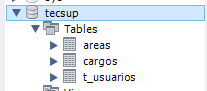
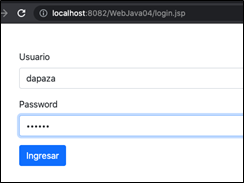
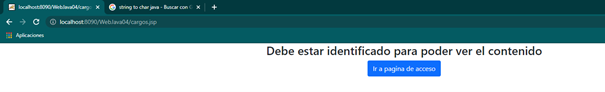
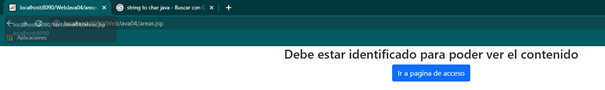
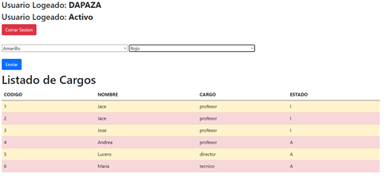

# TECSUP-DAW-2021-2-B
DESARROLLO DE APLICACIONES WEB GRUPO B - NIKOLL BONILLA
LABORATORIO 4: JSP Y ACCESO A BASE DE DATOS

Se implento una aplicacion web que se conecta con MySQL

- Permite validar el usuario
  

- No permitira el acceso hasta la validacion
  

- Permite ver el nombre del usuario logeado y su estado(Activo, No Activo) y cerrar sesion, asi como cambiar el color de las filas impares y pares.

  