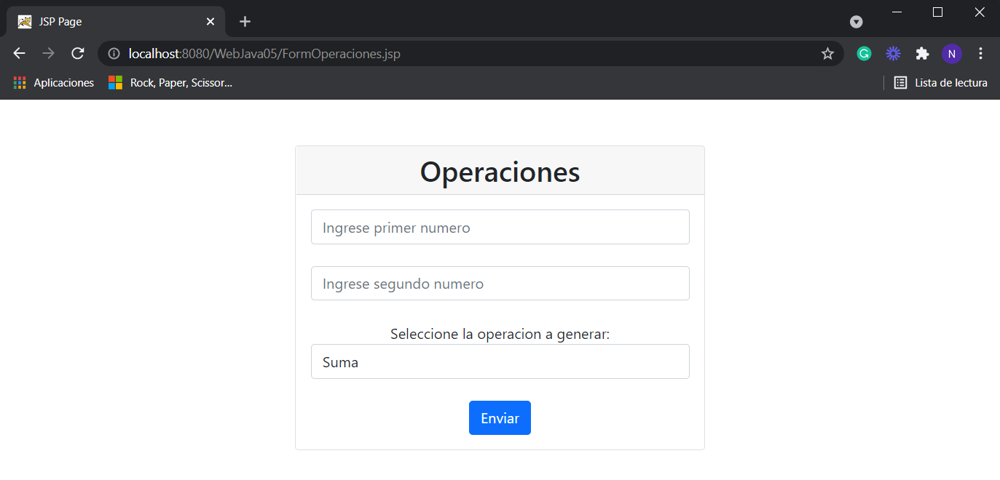
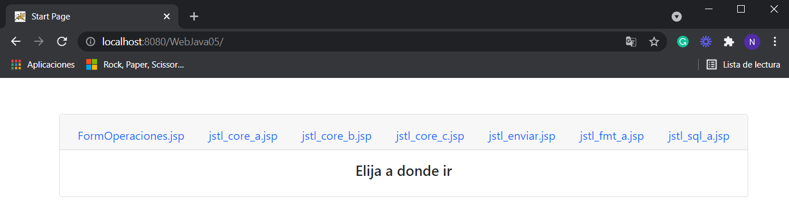
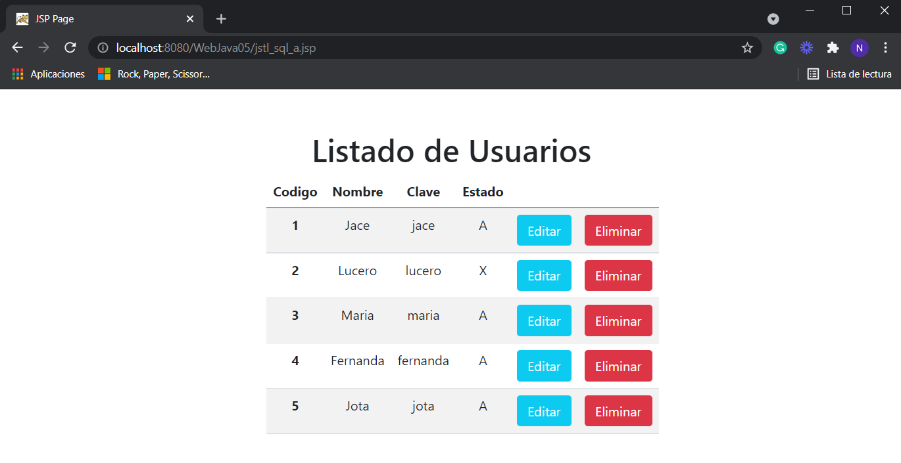
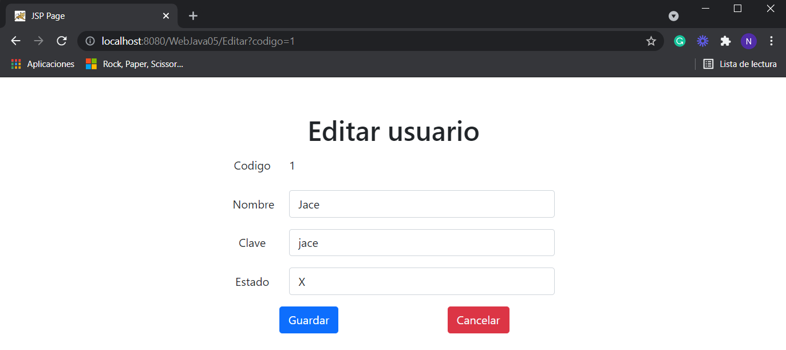

# TECSUP-DAW-2021-2-B
DESARROLLO DE APLICACIONES WEB GRUPO B - NIKOLL BONILLA
LABORATORIO 5: JAVA STANDARD TAG LIBRARY - JSTL 

1.	Se creo un nuevo archivo JSP denominado: FormOperaciones

	1.1. Este archivo permite pedir dos números y elegir una operación a realizar, al hacer clic en el botón Calcular muestra el resultado de operación

    
    
    1.2. La acción es controlada por el archivo Operaciones.java

2.	En index.html hay un enlace a todos los archivos JSP creados.

    

3.	En el archivo jstl_sql_a, en cada fila mostrada se muestra dos botones: uno para editar y otro para eliminar

    

    3.1.	Al hacer clic en Editar se muestra una pagina con los datos seleccionados (el campo estado se muestra en una lista para seleccionar A o X), y se muestra dos botones: Guardar y Cancelar. Si se guarda o cancela la acción se dirige a la pagina donde se listan los usuarios.

    

    3.2.	Al hacer clic en Eliminar, se borra el elemento y mostrara la lista de usuarios actualizados.

    3.3.	Estas acciones son controladas por el archivo Eliminar.java para eliminar, y Editar.java y update.java para editar.

  